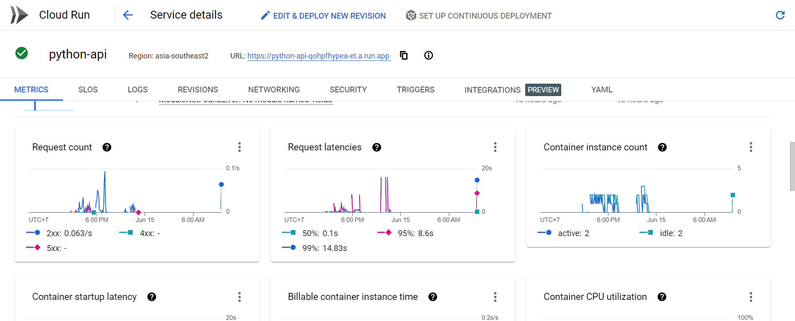

<!-- PROJECT LOGO -->
<br />
<div align="center">
  <a href="https://github.com/othneildrew/Best-README-Template">
    
  </a>

  <h3 align="center">Transliteration API</h3>

  <p align="center">
    Translate Your Latin Script to Aksara Jawa Script!
    <br />
    <a href="https://github.com/baksara-id/transliterasi-aksara-api"><strong>Explore the docs »</strong></a>
    <br />
    <br />
    <a href="https://github.com/othneildrew/Best-README-Template">View Demo</a>
    ·
    <a href="mailto:baksara.official@gmail.com">Report Bug</a>
    ·
    <a href="https://github.com/baksara-id/transliterasi-aksara-api/issues">Request Feature</a>
  </p>
</div>


<!-- TABLE OF CONTENTS -->
<details>
  <summary>Table of Contents</summary>
  <ol>
    <li>
      <a href="#about-the-project">About The Project</a>
      <ul>
        <li><a href="#built-with">Built With</a></li>
      </ul>
    </li>
    <li>
      <a href="#getting-started">Getting Started</a>
      <ul>
        <li><a href="#prerequisites">Prerequisites</a></li>
        <li><a href="#installation">Installation</a></li>
      </ul>
    </li>
  </ol>
</details>


<!-- ABOUT THE PROJECT -->
## About The Project



API service to translate letters, words, or sentences from latin (bahasa indonesia) to aksara jawa

<p align="right">(<a href="#readme-top">back to top</a>)</p>


### Built With

This API Service built using those frameworks/libraries :

* [![Flask][Flask]][Flask-url]
* [![OpenCV][OpenCV]][OpenCV-url]
* [![NumPy][NumPy]][NumPy-url]
* [![TensorFlow][TensorFlow]][TensorFlow-url]
* [![Pillow][Pillow]][Pillow-url]

<p align="right">(<a href="#readme-top">back to top</a>)</p>


<!-- GETTING STARTED -->
## Getting Started

This service can used in two ways, locally and cloud.

<font color="red"><h2>LOCAL RUN</h2></font>

Make sure that you already have PIP and Python Installation in your terminal. Here are the standard steps to install this API service:

### Pre-Installation

Clone this repository, the example below using https way to clone. If you want to use SSH or Github CLI, you can modify as your wish
* Git Clone
  ```sh
  git clone https://github.com/baksara-id/python-api.git
  ```

### Prerequisites

Install dependencies required to run this service :
* Install Dependencies in Requirements.txt
  ```sh
  pip install --no-cache-dir -r requirements.txt
  ```
To use locally, you need to modify some lines on some files. Here are the guide :
* Change your directory to api_model
* In main.py, comment line 9 and uncomment line 10
  ```sh
  # import api_model.BaksaraConst as Baksara
  import BaksaraConst as Baksara
  ```
* In Scanner.py, comment line 10 and 11, uncomment line 13 and 14
  ```sh
  # from api_model.Kelas import Kelas
  # from api_model.Scanner import Scanner

  from Kelas import Kelas
  from Scanner import Scanner
  ```
* In Kelas.py, comment line 6 and uncomment line 7
  ```sh
  # import api_model.BaksaraConst as BaksaraConst
  import BaksaraConst as BaksaraConst
  ```
* In BaksaraConst.py, comment line 4 and uncomment line 3
  ```sh
  # MODEL_PATH = './save_model/model.h5'
  MODEL_PATH = './api_model/save_model/model.h5'
  ```

### Run and Use The Service

1. Run command, make sure your command line refers to api_model directory :
   ```sh
   python main.py
   ```
2. Test endpoint in Postman : 


   
   

<p align="right">(<a href="#readme-top">back to top</a>)</p>


<font color="red"><h2>CLOUD RUN</h2></font>

### Run and Use The Service

1. Deployed URL on Cloud Run :
   ```sh
   https://python-api-qohpfhypea-et.a.run.app
   ```
2. Available endpoint :
   ```sh
   https://python-api-qohpfhypea-et.a.run.app/scanner
   ```
   ```sh
   https://python-api-qohpfhypea-et.a.run.app/kelas
   ```
4. Test endpoint in Postman :


   
   


<p align="right">(<a href="#readme-top">back to top</a>)</p>


<!-- MARKDOWN LINKS & IMAGES -->
<!-- https://www.markdownguide.org/basic-syntax/#reference-style-links -->
[contributors-shield]: https://img.shields.io/github/contributors/othneildrew/Best-README-Template.svg?style=for-the-badge
[contributors-url]: https://github.com/othneildrew/Best-README-Template/graphs/contributors
[forks-shield]: https://img.shields.io/github/forks/othneildrew/Best-README-Template.svg?style=for-the-badge
[forks-url]: https://github.com/othneildrew/Best-README-Template/network/members
[stars-shield]: https://img.shields.io/github/stars/othneildrew/Best-README-Template.svg?style=for-the-badge
[stars-url]: https://github.com/othneildrew/Best-README-Template/stargazers
[issues-shield]: https://img.shields.io/github/issues/othneildrew/Best-README-Template.svg?style=for-the-badge
[issues-url]: https://github.com/othneildrew/Best-README-Template/issues
[license-shield]: https://img.shields.io/github/license/othneildrew/Best-README-Template.svg?style=for-the-badge
[license-url]: https://github.com/othneildrew/Best-README-Template/blob/master/LICENSE.txt
[linkedin-shield]: https://img.shields.io/badge/-LinkedIn-black.svg?style=for-the-badge&logo=linkedin&colorB=555
[linkedin-url]: https://linkedin.com/in/othneildrew
[product-screenshot]: images/screenshot.png
[Next.js]: https://img.shields.io/badge/next.js-000000?style=for-the-badge&logo=nextdotjs&logoColor=white
[Next-url]: https://nextjs.org/
[React.js]: https://img.shields.io/badge/React-20232A?style=for-the-badge&logo=react&logoColor=61DAFB
[React-url]: https://reactjs.org/
[Flask]: https://img.shields.io/badge/-Flask-blue
[Flask-url]: https://flask.palletsprojects.com/en/2.3.x/
[OpenCV]: https://img.shields.io/badge/-OpenCV--Python-red
[OpenCV-url]: https://pypi.org/project/opencv-python/
[NumPy]: https://img.shields.io/badge/-NumPy-9cf
[NumPy-url]: https://numpy.org/
[Tensorflow]: https://img.shields.io/badge/-TensorFlow-important
[Tensorflow-url]: https://www.tensorflow.org/
[Pillow]: https://img.shields.io/badge/-Pillow-brightgreen
[Pillow-url]: https://pillow.readthedocs.io/en/stable/
[Vue.js]: https://img.shields.io/badge/Vue.js-35495E?style=for-the-badge&logo=vuedotjs&logoColor=4FC08D
[Vue-url]: https://vuejs.org/
[Angular.io]: https://img.shields.io/badge/Angular-DD0031?style=for-the-badge&logo=angular&logoColor=white
[Angular-url]: https://angular.io/
[Svelte.dev]: https://img.shields.io/badge/Svelte-4A4A55?style=for-the-badge&logo=svelte&logoColor=FF3E00
[Svelte-url]: https://svelte.dev/
[Laravel.com]: https://img.shields.io/badge/Laravel-FF2D20?style=for-the-badge&logo=laravel&logoColor=white
[Laravel-url]: https://laravel.com
[Bootstrap.com]: https://img.shields.io/badge/Bootstrap-563D7C?style=for-the-badge&logo=bootstrap&logoColor=white
[Bootstrap-url]: https://getbootstrap.com
[JQuery.com]: https://img.shields.io/badge/jQuery-0769AD?style=for-the-badge&logo=jquery&logoColor=white
[JQuery-url]: https://jquery.com 

